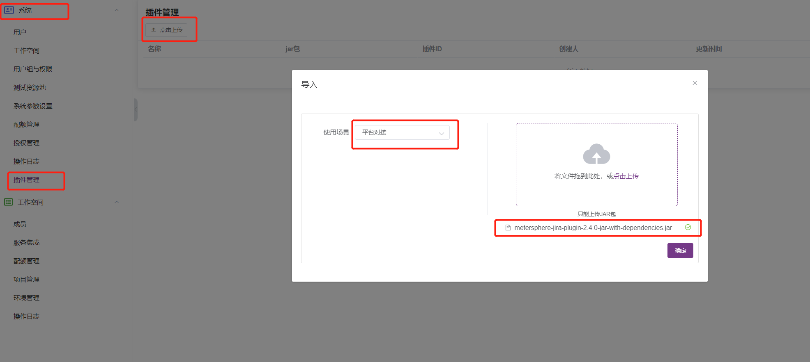
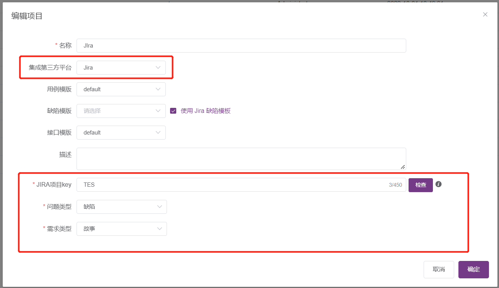
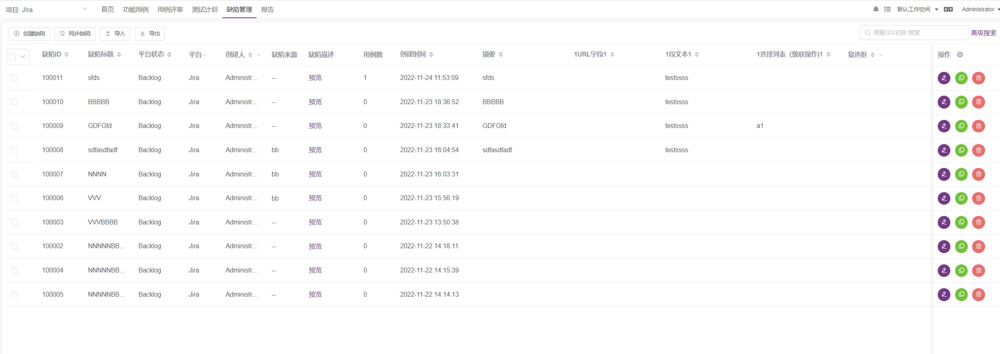

MeterSphere 缺陷平台插件
=============================
[MeterSphere](https://github.com/metersphere/metersphere) 是一站式开源持续测试平台，涵盖测试跟踪、接口测试、性能测试、团队协作等功能，兼容JMeter 等开源标准，有效助力开发和测试团队充分利用云弹性进行高度可扩展的自动化测试，加速高质量软件的交付

该项目是 Metersphere 为支持对接第三方平台缺陷与需求（如 Jira、禅道等），所开发的插件项目；用户可通过上传第三方平台的插件，实现 Metersphere 与对应平台缺陷与需求的创建、关联和同步，目前已插件化 Jira 平台插件，Metersphere 原本所支持的平台包括 TAPD、禅道以及 AzureDevops，尚在插件化中

### 下载插件
  在该项目的 [release](https://github.com/metersphere/metersphere-platform-plugin/releases) 页面下载对应版本的平台插件
  
### 版本说明
插件的版本与 Metersphere 版本相对应
 
例如：现有 Jira 插件 v2.4.0 与 v2.6.0(最新版本)，则
 
Jira v2.4.0 插件支持 v2.4.0 ~ v2.6.0 版本的 Metersphere
 
Jira v2.6.0 插件支持 v2.6.0 至最新版本的 Metersphere，直到有新的 Jira 插件发布

### 使用说明

## 问题反馈

如果您在使用过程中遇到什么问题，或有进一步的需求需要反馈，请提交 GitHub Issue 到 [MeterSphere 项目的主仓库](https://github.com/metersphere/metersphere/issues)
  
## 微信群

## License & Copyright

Copyright (c) 2014-2022 飞致云 FIT2CLOUD, All rights reserved.

Licensed under The GNU General Public License version 3 (GPLv3)  (the "License"); you may not use this file except in compliance with the License. You may obtain a copy of the License at

https://www.gnu.org/licenses/gpl-3.0.html

Unless required by applicable law or agreed to in writing, software distributed under the License is distributed on an "AS IS" BASIS, WITHOUT WARRANTIES OR CONDITIONS OF ANY KIND, either express or implied. See the License for the specific language governing permissions and limitations under the License.
